<div align="center">

# Risk Autopsy

### Every loss becomes a defense.

[](https://github.com/Affan-cybersecuritist/risk-autopsy/actions/workflows/test.yml)


**Razorpay AI Buildathon — Track 2: AI Risk Manager**

</div>

---

> ### TL;DR
> A fraud model tells you "is this transaction fraud?" **Risk Autopsy answers a different question: "prove this new policy is safer and cheaper than the one running today — before it deploys."** It's built as a CI/CD system for risk policies: every candidate gets an 8-gate PR (historical regression, adversarial coverage, evasion distance, fairness, off-policy value, blast radius, economic ₹ value, complexity), and an **Autonomous Risk Policy Engineer** runs the full loss → autopsy → discover → attack → harden pipeline on its own, stopping only at human approval. Its best result: the system's own drift monitor found a real blind spot in a defense it had called "fully converged," and a remediation loop closed the gap and re-verified it — not just flagged it.
>
> 🎥 **Demo video:** _add link here before submitting_ · 🚀 **Live demo:** _add hosted link here before submitting_ · 📄 Full write-up below

---

**Risk Autopsy explores a different problem than "will this transaction be fraud?": how can a merchant prove that a new risk policy is safer and more economical than the one it would replace — before that policy ever touches production?**

That's the actual thesis here, and it's why this project is built as **a CI/CD system for financial-risk policies**, not a fraud classifier with extra features bolted on. Every policy change here gets a pull request: a regression suite against every historical loss, an adversarial test, a robustness check (how small a behavioral change would defeat it), an economic-value check in real ₹, a blast-radius diff, a fairness check — and only then a human merge:

```
POLICY PR — v(candidate) vs. v(currently deployed)

🧪 Does it work?
  Historical regression      ✅  precision 90.6%, recall 100.0% on held-out test set

🛡️ Can it survive?
  Adversarial coverage       ❌  88.4% of a fresh 2,000-candidate attack caught  (needs ≥90%)
  Minimum evasion distance   ❌  0.146 normalized units via ['mid_amount']  (needs ≥0.15)

💰 Safe to deploy?
  Fairness                   ❌  1 segment flagged, severe=True
  Off-policy confidence      ✅  DR/DM agreement 96.3%
  Blast radius               ✅  5 flip(s) worth a human's attention
  Complexity                 ✅  tree depth 3, 13 nodes, 7 feature(s)
  Economic value             ❌  ₹14,59,002 vs. currently-deployed policy's ₹14,63,002

Status: ❌ BLOCKED — 4 of 8 gates failed, nothing registered
```

This is a **real, live-generated** transcript (`backend/agent.py::compute_gates_for_tree`, invoked here via a real `retrain()` call) — not a mockup written for the pitch. Every version in this project's Policy Version History (section 4.9 of the dashboard) carries the same 8-gate checklist, computed the same way, whether it came from a manual retrain, a re-run adversarial arms race, or the autonomous engineer below. Gates decide eligibility; nothing about a candidate's provenance does.

The lifecycle this pull request sits inside — loss → autopsy → decision-path attribution → discover → attack → harden → the gate checklist above → human approval → deploy → drift → remediate → back to autopsy — is diagrammed in [Core risk-policy lifecycle](#core-risk-policy-lifecycle) below, and **an Autonomous Risk Policy Engineer** runs the whole thing without a human orchestrating every step, stopping only at the approval boundary:

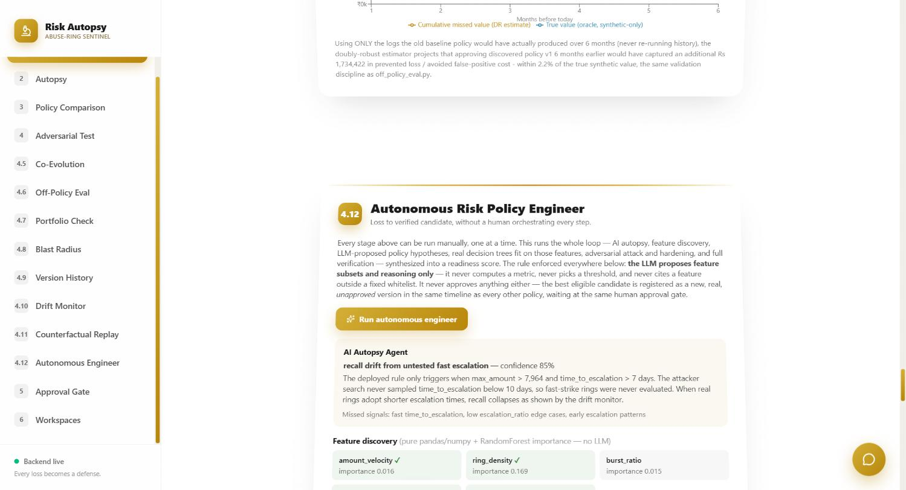

---

## See it end-to-end

One real case, all the way through the pipeline, using this project's actual data — nothing below is invented for the pitch.

**A confirmed loss occurs**
₹47,58,059 in chargebacks over 90 days, across 180 customers, 45 detected abuse rings.

↓

**Risk Autopsy reconstructs the decision chain**
For customer #3000: a low-value purchase, a wait, an escalated high-value purchase — and a shared address with 3 other accounts. Not an isolated incident; a coordinated ring the existing threshold never flagged.

↓

**Root cause**
The existing control was `amount > ₹25,000` — a static number with no memory of behavior. It catches loud, obvious fraud and misses everything that stays just under the line or hides in the shape of the transaction sequence instead of its size.

↓

**New policy discovered**
A decision tree over leakage-free behavioral features (escalation ratio, time-to-escalation, device/address sharing) — **90.6% precision, 100% recall**, vs. the baseline's 32.9%/58.3%.

↓

**Adversarial test**
The policy's own feature importances are read back to find its blind spot (`escalation_ratio`, 96% of its decision weight) and an evasion is crafted specifically to exploit it. v1 misses 100% of that evasion.

↓

**Hardened policy**
Retrained against the evasion, then verified against the full 3,180-customer population: **100% precision / 100% recall / 0 false positives**, and it now catches 40/40 adversarial attempts — on the attack surface that was actually tested (see [Drift as self-critique](#drift-monitoring-the-system-critiques-itself) below for the honest limit of that claim).

↓

**Blast radius review**
Before anyone approves this: 25 customers newly flagged (₹2,71,122 at stake), 57 newly cleared. Of those 82 flips, **5 are genuinely worth a human's attention** — the rest are the policy working as intended.

↓

**Human approval**
An identity-verified reviewer (Supabase sign-in + live face match, independently re-checked server-side) approves the specific version that was reviewed above — not a rubber stamp on an aggregate metric.

↓

**Post-deployment monitoring**
Months later, drift simulation exposes that the adversarial search itself had an untested region — a ring that strikes within a week evades the "converged" policy entirely. The system found this on its own.

↓

**Closed the loop**
The gap doesn't stay a footnote. The exact search dimension the drift monitor found untested is fed back into the arms race, which re-converges into a new policy — re-verified against the same drift simulation, recall now holding at 100% across all 12 months. Registered as v3 in the same approvable timeline. See below.

---

## Core risk-policy lifecycle

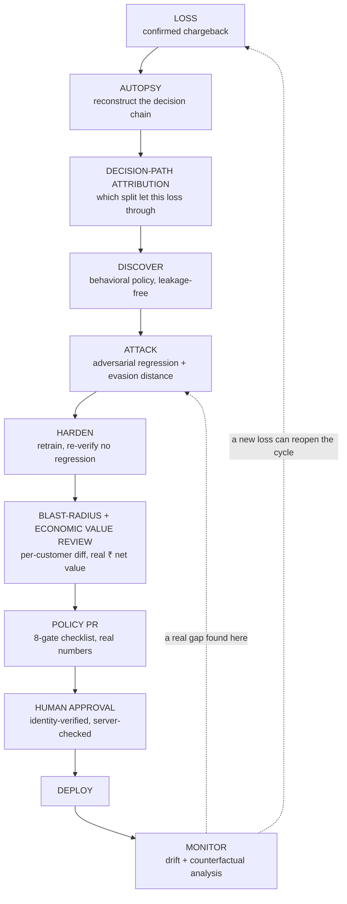

Every loss becomes a regression test. Every adversarial evasion becomes a security test. Every policy change gets a measured blast radius and a real ₹ economic-value check before a human signs off. Every deployed policy is watched for the day it stops working — and when it does, that finding becomes a new attack, not just a note. This is a real, exercised loop: `src/drift_monitor.py` found a gap, `src/remediate_drift.py` fed it back into the attack stage, and the result was re-verified, not just proposed.

**The decision-path attribution step, made honest about its scope:** `backend/causal_graph.py` walks the exact split sequence a `DecisionTreeClassifier` took for one customer's real feature values — which threshold sent them left or right, and which leaf they landed in. For a real loss that slipped through, this shows precisely which split let them through, and which split they came closest to tripping (`closest_call`). This is a true statement about *this model's* decision, computed via sklearn's own `tree_.feature`/`tree_.threshold` traversal — not a claim about real-world causality, and the API response says so explicitly in a `scope_note` field, not just in this README.

---

## The Autonomous Risk Policy Engineer

Every stage in the lifecycle above can be run manually, one at a time — a human deciding what to try next. `backend/agent.py` runs the whole loop instead: **loss to verified candidate, without a human orchestrating every analytical step.** The human enters at approval, not at analysis.

One architectural rule is enforced everywhere in this file, without exception:

> **The LLM proposes. ML and statistics verify. The verification suite gatekeeps. The LLM never computes a metric, never picks a numeric threshold, and never cites a feature that doesn't already exist in the real data.**

Concretely, one call to `POST /api/agent/run` does this, in ~8–10 seconds, using real computation at every step:

1. **AI Autopsy Agent** — an LLM reasons over real held-out results, the real drift finding, and real blast-radius rows to produce a structured root-cause diagnosis (`failure_type`, `root_cause`, `missed_signals`, `candidate_features`) — grounded only in numbers already computed elsewhere in this pipeline, nothing invented.
2. **Automated feature discovery** — pure pandas/numpy arithmetic on already-established leakage-free columns (`amount_velocity`, `ring_density`, `burst_ratio`, `dual_sharing_signal`, `age_to_escalation_gap`), screened by a real RandomForest importance test. No LLM involved in this step at all.
3. **Policy Synthesizer** — the LLM proposes several candidate policies as **feature subsets only** (never thresholds), each with a rationale grounded in the autopsy and the discovered-feature importances. A real `DecisionTreeClassifier` is then fit on exactly those features against real training data — scikit-learn picks every threshold, never the LLM. A full-feature "baseline" candidate is always included alongside the LLM's narrower, more targeted proposals, so novel ideas are judged against "use everything," not just against each other.
4. **Red team / blue team** — each candidate is attacked with the same realistic-archetype sampling already used in `src/coevolution.py` and `src/remediate_drift.py`, and hardened by folding evasions back into training, the same real method throughout this project — never reimplemented with different, weaker semantics for the sake of a demo.
5. **Policy Verifier — the real gatekeeper, gates first.** Every candidate is checked against **eight** independently-named, independently-checkable gates, grouped into three questions so they're easy to hold in your head in a 5-minute walkthrough — the underlying eight stay independent and machine-enforced, this is purely how they're read:

   | | Gate | Threshold |
   |---|---|---|
   | 🧪 **Does it work?** | Historical regression | precision ≥85%, recall ≥95% — this project's own v1 bar |
   | 🛡️ **Can it survive?** | Adversarial coverage | ≥90% caught in a fresh 2,000-candidate attack across every dimension at once |
   | 🛡️ **Can it survive?** | Minimum evasion distance | ≥0.15 normalized units (`src/evasion_distance.py`) — the smallest single/two-axis change that flips the decision; distinct from coverage, since a policy can catch 90% of a sweep and still fall to a tiny nudge on the other 10% |
   | 💰 **Safe to deploy?** | Fairness | no segment with both >5× ratio AND >2% absolute FP rate (`src/portfolio_conflict_check.py`'s method) |
   | 💰 **Safe to deploy?** | Off-policy confidence | doubly-robust vs. direct-method agreement ≥80% |
   | 💰 **Safe to deploy?** | Blast radius | ≤15 flips needing human review |
   | 💰 **Safe to deploy?** | Economic value | candidate's real ₹ net value ≥ the currently-deployed policy's on the same held-out population (`compute_binary_net_value`) — a regression gate against real money, not just precision/recall |
   | 💰 **Safe to deploy?** | Complexity | tree depth ≤8 — a human must be able to read the rule |

   A weighted score exists too, but only as a *secondary* ranking aid between multiple already-eligible candidates — it never decides eligibility. Ask "why blocked?" and the answer is always a named gate and its real number, never a magic total.
   - The **Attack Coverage Map** below is a *separate diagnostic*, not this gate: it decomposes coverage *per behavioral dimension* (isolating amount, timing, sharing independently) so a reviewer can see *which axis* a gap lives on — the 2,000-candidate gate above is what actually decides eligibility; the per-dimension map is what explains a failure if there is one.
6. **An explicit `NO_APPROVAL_ELIGIBLE_POLICY` state.** If every candidate fails at least one gate, the system says so, registers nothing, and recommends generating more hypotheses or a human investigation — it does not lower the bar to produce a winner. A system that can say this is more trustworthy than one that always finds one.
7. **Never auto-approves.** The best `APPROVAL_ELIGIBLE` candidate — if one exists — is registered as a new, real, evaluated, **unapproved** version in the same policy-history timeline every other version lives in, waiting at the same identity-verified human approval gate as v1/v2/v3.

**Multiple real runs, committed in this repo, with a real recorded timeline** (every timestamp is an actual elapsed second, not staged) — non-deterministic LLM hypothesis generation, checked every time against the same unchanged, deterministic gates:

| Run | Winning hypothesis | Precision | Recall | FP | Status |
|---|---|---|---|---|---|
| v4 | `AmountVelocity` | 100% | 100% | 0 | registered, unapproved |
| v5 | `AmountVelocityCombo` | 100% | 100% | 0 | registered, unapproved |
| v6 | full feature set (baseline) | 100% | 100% | 0 | registered, unapproved |
| v7 | `AmountHybrid` | 100% | 100% | 0 | registered, unapproved |
| v8 | full feature set (baseline) | 100% | 100% | 0 | registered, unapproved |
| v9 (latest) | full feature set (baseline) | 100% | 100% | 0 | registered, unapproved |

Every run's LLM proposals differ (temperature 0.4, by design) — only a candidate that clears all eight gates is ever registered, which is why every winner above lands at the same 100%/100%/0 FP regardless of which features it used. *(Honest limitation, found and fixed during review: v4–v7 predate a fix that made the engineer reliably persist its computed gate results into `policy_history.json` — their precision/recall/FP above are real, permanently-recorded numbers, but their individual gate pass/fail record wasn't saved, and `policy_history.json` now says so explicitly via each entry's `gates_note` rather than silently showing nothing. v8 onward have their full 8-gate record intact — see the real example below. Separately, `agent_run_results.json` is overwritten each run, so per-run candidate/blocked counts are only retained for the most recent run.)*

### Policy lineage — which version is canonical, which is active

Nine versions exist for different reasons, and conflating them is exactly the kind of confusion a financial-risk system can't afford:

| Version | What it demonstrates |
|---|---|
| **v1** | Behavioral policy discovery (the brief's required deliverable) |
| **v2** | Adversarial hardening (the co-evolution arms race) |
| **v3** | **The canonical drift-remediation demonstration** — the fast-strike gap found, closed, and re-verified |
| **v4 – v9** | Autonomous-engineer candidate runs — evidence the gates hold across repeated, non-deterministic generation (v8/v9 are the reference runs for a complete real gate record — see below) |

**None of these is "the final policy" by default — and right now, none of them is even active.** This project has no live transaction stream to deploy a policy *into* (see Data Honesty below), so "active" is defined the only honest way it can be here: `backend/policy_history.py::annotate_deployment_status` marks the **highest-versioned entry a human has actually approved** as `ACTIVE`; everything newer is `PROPOSED`; anything once-approved but since outranked is `SUPERSEDED`. **In this repo's own committed state, nothing has been approved — every version, including v1, is `PROPOSED`.** A remediation or an autonomous run registering v8 tomorrow would not change that; only a real, identity-verified approval does. `GET /api/policy/active` returns this directly.

<details>
<summary>A real Policy Decision Record, from the committed v9 run, all 8 gates intact — click to expand</summary>

```
POLICY v9 (autonomous: full feature set (baseline))
─────────────────────────────────────
Why generated:    Autonomous run (GROQ_API_KEY unset in this environment - autopsy agent
                   degraded to its labeled fallback exactly as designed, hypothesis
                   generation fell back to the deterministic baseline candidate)
Features:         n_purchases_before_max, max_amount, escalation_ratio, time_to_escalation,
                   account_age_at_escalation, device_sharing, address_sharing, + 4 accepted
                   discovered features (11 total)
Thresholds:       ML-derived (DecisionTreeClassifier, fit on real training data)

Historical regression    PASS   precision 100.0%, recall 100.0% on held-out test set
Adversarial coverage     PASS   100.0% of a fresh 2,000-candidate attack
Minimum evasion distance PASS   no evasion found within the searched realistic range
Fairness                 PASS   2 segment(s) flagged, severe=False
Off-policy confidence    PASS   DR/DM agreement 91.5%
Blast radius             PASS   0 flip(s) worth a human's attention
Economic value            PASS   Rs 1,463,002 vs currently-hardened policy's Rs 1,463,002
Complexity                PASS   tree depth 3, 7 nodes, 11 feature(s)

Readiness:         APPROVAL ELIGIBLE (89.2/100)
Deployment status: PROPOSED (v3 remains the canonical demonstration; nothing is ACTIVE)
Generated by:      Autonomous Risk Policy Engineer (backend/agent.py)
Approved by:       —
```

This is close to a machine-generated pull request for a risk policy: the AI opens it, the gates review it, red team attacks it, blast radius shows the diff, and only a human can merge it. This record is also a real, unplanned demonstration of the AI-assistance degradation this README promises elsewhere: no Groq key was configured for this particular run, so the autopsy step visibly fell back to its labeled "unavailable" state instead of faking a narrative — and the rest of the pipeline (feature discovery, hypothesis synthesis's deterministic fallback, attack/harden, all 8 gates) ran and passed regardless, exactly as claimed in "AI usage — honestly scoped" below.

</details>


**Two real bugs found and fixed while building this, worth stating plainly, not hidden:** the fairness gate first flagged a candidate as "severely" unfair from a segment ratio of 57× — the absolute rate behind that ratio was one false positive in a 52-person segment, and a near-zero population baseline (0.03%) makes any single misclassification look catastrophic by ratio alone. Fixed by requiring both a large ratio **and** a real absolute rate (>2%). Separately, the readiness gate initially only floored recall, so a 54.5%-precision candidate (40 false positives) was marked eligible — fixed by adding the same precision floor v1 already had to clear. An autonomous system doing its own statistics has to get both of these right, or it blocks good policies, or ships bad ones, for the wrong reasons.

**Attack coverage, generalized beyond the one dimension that broke.** The strike-timing gap `drift_monitor.py` found was one behavioral axis. `src/attack_coverage.py` sweeps every axis a real ring can vary — independently, holding everything else at a known-abuse value — and measures what fraction the deployed policy actually catches:

| Dimension | Pre-remediation | Post-remediation |
|---|---|---|
| Amount manipulation | 100% | 100% |
| Ring density | 100% | 100% |
| Device sharing | 100% | 100% |
| Address sharing | 100% | 100% |
| **Strike timing** | **73%** | **100%** |

Worth stating plainly: only one dimension was ever actually broken. The other four were already fully covered before remediation — the honest finding is a narrow, real gap, not a system that was broken everywhere.


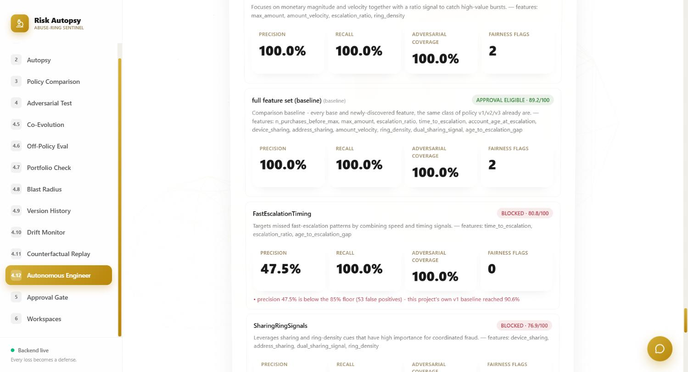

---

## Why Risk Autopsy is different

|  | Conventional fraud model | Risk Autopsy |
|---|---|---|
| Starts from | A transaction | A confirmed loss |
| Output | A risk score | A defensible policy |
| Evaluation | Offline metrics | Metrics **+** adversarial regression |
| Policy changes | Retrain and deploy | Blast-radius review first |
| Approval | A deployment pipeline | A human approval gate, server-enforced |
| After deployment | Periodic monitoring | Drift **and** counterfactual analysis |
| Failure learning | Another training cycle | Every loss becomes a permanent regression test |
| Candidate generation | A human hand-picks features and hyperparameters | An LLM proposes feature-subset hypotheses; scikit-learn fits every threshold from data |
| Human's role | Builds the analysis, then ships it | Enters only at approval — analysis runs end-to-end on its own |

---

## Key differentiators

### Policy blast radius — git diff for a risk policy

Precision and recall tell you how a policy performs in aggregate. They don't answer the question a reviewer actually asks before clicking approve: *which specific accounts does this change, how much money is affected, and is any one of them going to be a problem?*

`src/blast_radius.py` computes a literal per-customer diff between the baseline and candidate policy on the held-out test set — "newly flagged" and "newly cleared," ranked by dollar impact — then narrows to the subset that's actually worth a human's time: a newly-flagged customer who **isn't** a known abuser, or a newly-cleared customer who **is** one. Everything else is the policy working as intended and doesn't need attention.

**Result:** 25 customers newly flagged (₹2,71,122 at stake), 57 newly cleared, and of those 82 flips, exactly **5** are worth a human's attention. For each one, an on-demand, plain-language, jargon-free letter can be drafted — the actual explanation a customer would receive, not the internal analyst note.

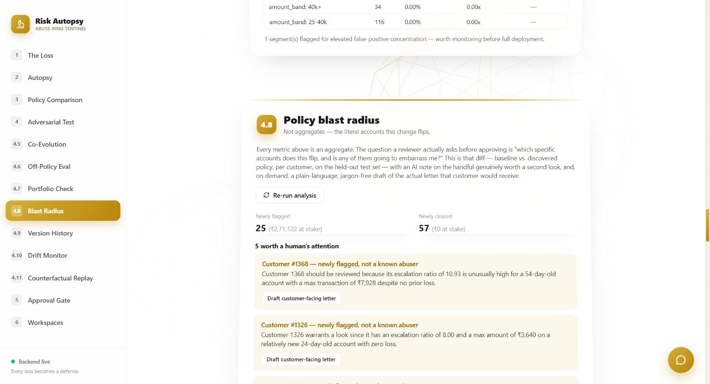

### Automated adversarial policy regression testing

Conventional systems evaluate `train → test → deploy`. Risk Autopsy evaluates `train → test → attack → harden → retest` — and then automates the attack step into a converging arms race, not a one-shot.

`src/adversarial_test.py` introspects the policy's own feature importances to find its real blind spot, crafts an evasion targeting exactly that weakness, retrains, and re-verifies no regression. `src/coevolution.py` extends this into an automated attacker/defender loop: the attacker keeps searching for evasions within the known abuse archetype, the defender retrains after every round that finds one, until the attacker exhausts its search budget with zero wins.

**Result:** converges at generation 2. The final policy, re-verified against the full 3,180-customer population, reaches **100% precision / 100% recall / 0 false positives**, and catches 40/40 adversarial attempts *within the search envelope that was tested* — see the next section for why that qualifier is doing real work.

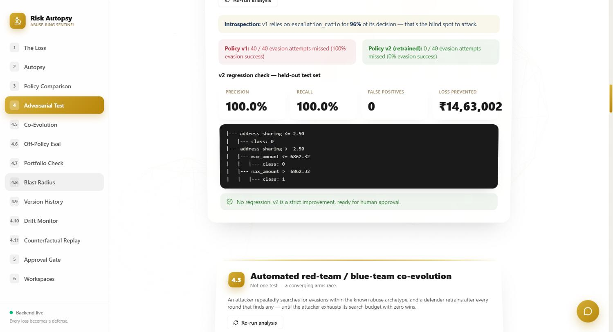
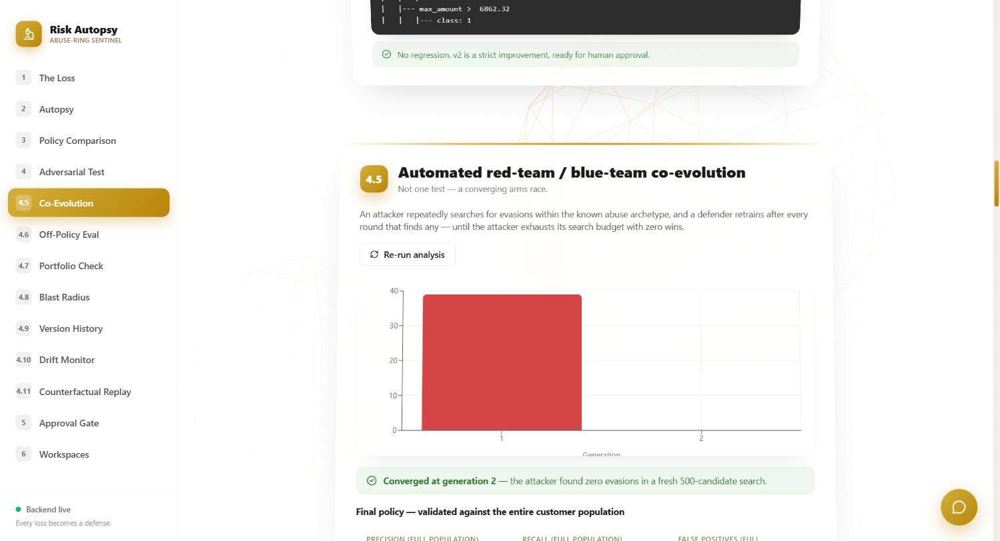

### Off-policy evaluation — can you value a policy before deploying it?

A real fraud system only observes outcomes under whatever policy actually ran. Naively replaying those logs to score a *different* candidate policy is statistically biased — the customers the old policy acted on were never a random sample.

Risk Autopsy implements a real **doubly-robust (DR) off-policy estimator** (Dudík, Langford & Li), and — uniquely possible because the underlying data is synthetic — validates it against the oracle truth: the DR estimate lands within **2.2%** of the true value, using only logged, partial data, vs. 6.9% for a direct model alone and 18.5% for importance-weighting alone. The full mathematical treatment is in [`docs/ENGINEERING_LOG.md`](docs/ENGINEERING_LOG.md); the short version is: **yes, and here's the proof it's trustworthy before anyone relies on it.**

This same estimator is then replayed over historical time (**counterfactual replay**, see Results below) to answer the practical follow-up a business stakeholder actually asks: *how much did waiting to approve this cost us?*

### Drift monitoring: the system critiques itself

Every stage above evaluates the policy at one moment — the moment it was approved. `src/drift_monitor.py` asks what happens six months later, and in building it, this project found a real, previously-unknown gap in its own strongest claim.

The co-evolution arms race converges with zero evasions found across a 500-candidate search, every generation. But its attacker's search bounds only ever sampled a strike wait of 10–30 days. Reading the final policy's actual learned decision rule — `max_amount > ₹7,964 AND time_to_escalation > 7 days` — shows every candidate the arms race ever tried was already comfortably on the "flag" side of that boundary. **The adversarial search never tested a ring that strikes within a week.**

This is not a contradiction in the project — it's the honest distinction the system itself surfaces:

- **Robust on evaluated attacks:** yes — 100% precision / 100% recall / 0 false positives on the full 3,180-customer evaluation population, and 40/40 adversarial attempts within the tested search envelope.
- **Uncovered attack space:** a fast-strike ring (under ~7 days) was never in that envelope.
- **Simulated future drift:** `drift_monitor.py` simulates rings gradually adapting toward that untested region and tracks the frozen, deployed policy's real recall each month.
- **Result:** recall holds at 100% through month 7, then collapses to 0% by month 11 as the simulated behavior crosses outside the tested envelope. The alert fires at month 10.
A policy can be robust against everything you tested and still fail against something you never tested. Finding that out from a live monitor instead of a real loss is the point of building one — and finding it is only half the point.

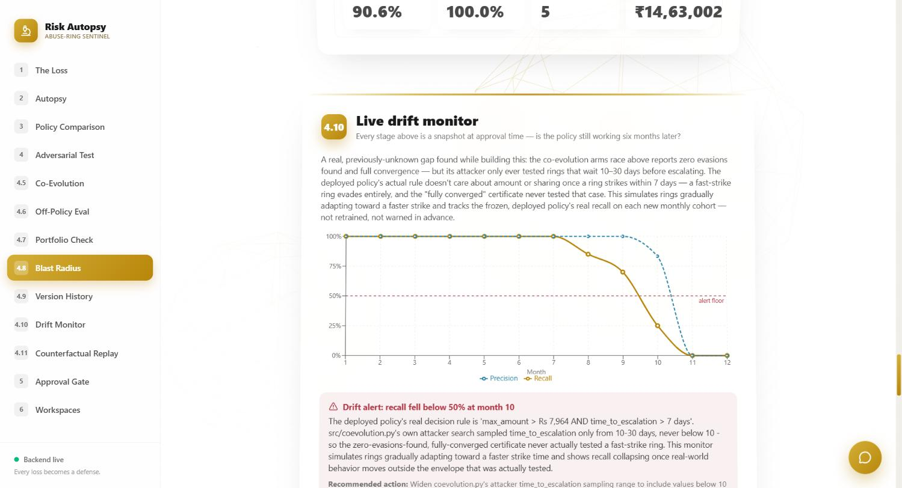

#### Closing the loop, not just naming it

`src/remediate_drift.py` takes the exact gap the monitor found and does something with it: it re-runs the adversarial arms race, starting from the already-deployed policy (not a restart — prior hardening isn't thrown away), with the attacker's search widened to include the strike-wait range that was missing (1–30 days instead of 10–30, a strict superset — nothing already tested is discarded). It re-converges at generation 2. Then it re-runs the **identical** drift simulation — same months, same synthetic cohorts, same seed — against the new policy, as proof rather than a claim.

**Result: recall holds at 100% across all 12 simulated months, including the previously-fatal fast-strike region.** The new policy's actual decision rule no longer depends on `time_to_escalation` at all — confirmed by inspecting the rule text, not assumed. It's registered as **v3** in the same policy-history timeline as every other version, awaiting the same identity-verified approval — not a side artifact.

This deliberately does **not** overwrite the original arms race's "converged at generation 2" result — that's real, honestly-earned evidence for the search space it tested, and erasing it to make the fix look more dramatic would be exactly the kind of dishonesty this project argues against. Both exist side by side: v2 (adversarially-hardened, real gap and all) and v3 (remediated, gap closed and verified).

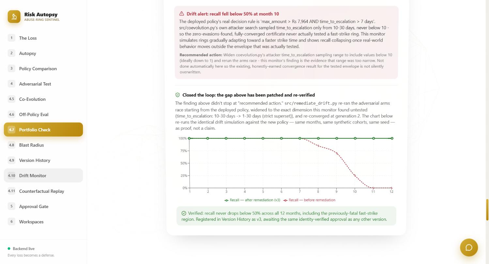

### Economic intervention optimizer — graded actions, not binary ALLOW/BLOCK

Every policy above outputs ALLOW or FLAG. A real risk team has more levers: step-up verification, a delay, manual review, a hard block — each preventing a different fraction of a loss at a different friction cost to a genuine customer. `src/intervention_optimizer.py` computes `expected_net_value(action) = P(abuse|x)·loss_rs·prevent_frac(action) − P(genuine|x)·friction_cost(action)` per held-out customer and picks the best action, using a separately-fit `RandomForestClassifier` purely for a continuous risk score (the governed decision tree's leaves are too pure post-hardening for a 5-way ladder to mean anything — see the honest finding below).

**Honest finding, not hidden:** this dataset's abuse rings share device/address ids by construction, so 934 of 935 held-out customers resolve to near-0% or near-100% risk — the ladder mostly collapses back to ALLOW/BLOCK on *this* data, same as the binary policy. Real value here would show up on messier real-world data with weaker separability. What's provable regardless: a synthetic decision-boundary sweep at a representative loss (₹30,479) shows the mechanism genuinely grades — `p≥0.00→ALLOW`, `p≥0.01→DELAY`, `p≥0.02→MANUAL_REVIEW`, `p≥0.13→BLOCK` — the optimizer isn't secretly a binary rule with extra steps, it just has nothing to grade on this particular dataset's near-perfectly-separable population.

### Minimum evasion distance — a robustness metric, not just a coverage percentage

The attack coverage map below answers "what % of a sweep gets caught." `src/evasion_distance.py` asks a sharper question: starting from a pattern the policy currently catches, what is the **smallest** behavioral change — one dimension, or two combined — that flips the decision? A policy needing a bigger change to defeat is more robust, even at identical raw coverage.

**Result:** pre-remediation, the policy evades at just **0.45 normalized units** via `time_to_escalation` alone — independently rediscovering, via a completely different search technique, the exact same fast-strike gap `drift_monitor.py` found. Post-remediation, no single- or two-axis perturbation within the searched realistic range evades it at all — fully robust to this search, not just "improved."

*One more capability exists but is deliberately not a headline here: `src/residual_cluster_analysis.py` illustrates what an "unknown-unknown" scan would look like (clustering residual/misclassified customers), but it's marked `EXPERIMENTAL` everywhere it appears — including a required `disclaimer` field in its own JSON output, not just UI copy — because a fixed-typology synthetic dataset structurally cannot produce evidence of a real, previously-unseen fraud pattern. See the dashboard's "Residual Scan (experimental)" section for the full, honestly-caveated detail; it's not repeated here to keep this section focused on things that are actually differentiating.*

---

## Results

```
Baseline (amount > ₹25,000)
  32.9% precision · 58.3% recall · 57 false positives
                    │
                    ▼
Discovered v1 (behavioral, leakage-free)
  90.6% precision · 100.0% recall · 5 false positives
                    │
                    ▼
Hardened v2 (adversarially retrained)
  100.0% precision · 100.0% recall · 0 false positives · 40/40 adversarial attempts caught
                    │
                    ▼  (drift monitor finds a real gap outside v2's tested envelope, months later)
Remediated v3 (arms race re-run with the gap closed)
  100.0% precision · 100.0% recall · 0 false positives · recall holds at 100% across all 12 drift-simulated months
```

| Metric | Value |
|---|---|
| Loss prevented (v1/v2 vs. baseline's ₹11,91,880) | **₹14,63,002** / ₹14,63,002 total |
| Off-policy DR estimate error vs. oracle | **2.2%** (vs. 6.9% Direct Method, 18.5% IPS) |
| Blast radius | 25 newly flagged (₹2,71,122 at stake), 57 newly cleared, **5 of 82** flips worth human attention |
| Portfolio conflict check | found a real 8.2× elevated false-positive rate in the ₹5–15k segment (small sample, reported not hidden) |
| Counterfactual replay (6 historical months) | **₹17,34,422** estimated missed value from delayed approval, within 2.2% of oracle |
| Live drift monitor (12 simulated months) | recall holds at 100% through month 7, **collapses to 0% by month 11** as behavior exits the tested envelope; alert fires at month 10 |
| Closed-loop remediation (v3) | re-converged at generation 2 with the search envelope widened; re-verified recall **holds at 100% across all 12 months**, including the previously-fatal region |
| Autonomous Risk Policy Engineer (v7) | 4 candidates generated (1 baseline + 3 LLM hypotheses), **2 correctly BLOCKED** on the precision gate, winner registered at 100% precision/recall — human approval still required |
| Attack coverage map | 4 of 5 dimensions already at 100% pre-remediation; **strike timing was the one real gap (73% → 100%)** — narrow, not universal |
| Minimum evasion distance | pre-remediation: evades at **0.45 normalized units** via `time_to_escalation` alone (same gap `drift_monitor.py` found, independently rediscovered); post-remediation: **no evasion found** within the searched range |
| Economic intervention optimizer | on this near-perfectly-separable dataset the ladder mostly resolves to ALLOW/BLOCK (934/935 customers have risk score <0.1 or >0.9); a synthetic decision-boundary sweep proves the mechanism itself grades all 4 non-dominated actions |
| Residual behavior scan (experimental) | v1: 5 residual customers, k=2 clusters found (silhouette 0.61); **explicitly not a fraud-discovery claim** — see disclaimer |

v1's 90.6% precision (5 real false positives, not a suspiciously clean 100%) is intentional — an earlier "100%/100%, 0 FP" result was treated as a red flag for data leakage, not a win. See [`docs/ENGINEERING_LOG.md`](docs/ENGINEERING_LOG.md).

---

## Evaluation rigor

This project's own tooling found and disclosed a real weakness: the headline population is near-perfectly separable (934/935 held-out customers score near-0% or near-100% risk — see the intervention-optimizer finding above). Rather than leave that as a caveat, five additional evaluations exist specifically to stress-test whether the headline numbers survive harder conditions, not just to look more impressive.

**Difficulty tiers** (`src/difficulty_tiers_eval.py`) — the already-frozen, never-retrained hardened policy scored against three populations that are harder *by construction* (see `src/dataset_tiers.py`): `ambiguous` adds genuine customers who look ring-like without being rings (shared corporate device, genuine gift escalation, genuine high-frequency buyers), `adversarial` adds the same ring mechanics deliberately camouflaged (escalation spread across two purchases, a wide strike-timing window, partial device sharing). The first version of this script retrained a fresh tree per tier and found every tier scoring ~100% — a real methodological mistake (a freshly-retrained tree just re-learns whatever separates that tier's own labels), logged in `docs/ENGINEERING_LOG.md` and fixed by scoring one frozen policy across all tiers instead:

| Tier | Precision | Recall | FP rate |
|---|---|---|---|
| Easy | 99.5% | 100.0% | 0.03% |
| Ambiguous | **74.7%** | 100.0% | 1.9% |
| Adversarial | **80.8%** | **98.5%** | 1.9% |
| Drifted (reuses the real drift-monitor simulation) | 100% (month 1) → **0%** (pre-remediation) → 100% (post-remediation) | | |

**Secret holdout** (`src/secret_holdout_eval.py`) — a one-shot score against seed 9999, never referenced anywhere else in this repo's development: **98.4% precision, 100% recall, 3 false positives** — real imperfection, not another suspiciously clean 100%. Honestly scoped: this mitigates "did you optimize against your own split" as far as a synthetic-only project can, it does not prove real-world validity (same generator family, not independent data) — stated in the tool's own `scope_note` field.

**10-seed evaluation** (`src/multi_seed_eval.py`) — the discovery stage, independently re-run across 10 seeds:

| Metric | Mean | Std |
|---|---|---|
| Precision | 98.2% | ±1.8% |
| Recall | 99.0% | ±1.4% |
| FP rate | 0.1% | ±0.1% |

**Ablation study** (`src/ablation_study.py`) — every stage is an already-real artifact from this pipeline, scored on the same held-out set with the same reward function, not a new experiment:

| Stage | Net value |
|---|---|
| Baseline (amount > ₹25,000) | ₹11,46,280 |
| + Behavioral features (v1) | ₹14,59,002 |
| + Adversarial hardening (v2) | ₹14,63,002 |
| + Drift remediation (v3) | ₹14,63,002 |
| + Economic intervention optimizer | ₹14,62,861 |

The big jump is behavioral features over the naive baseline; adversarial hardening and drift remediation hold that value under attack rather than adding more of it — a real, legible story of which stage does what.

**Policy mutation testing** (`src/mutation_testing.py`) — deliberately breaks the deployed policy's tree structure (threshold ±10%, or an inverted split) and checks whether this project's own regression gate catches it: **100% mutation score** (4/4 behaviorally-different mutants caught). Disclosed plainly, not inflated: the hardened policy is a shallow tree (2 internal nodes), so only 6 mutants exist and only 4 actually change a prediction — "100%" here means every mutation that did anything was caught, not that thousands were tested.

---

## Screenshots

| | |
|---|---|
| 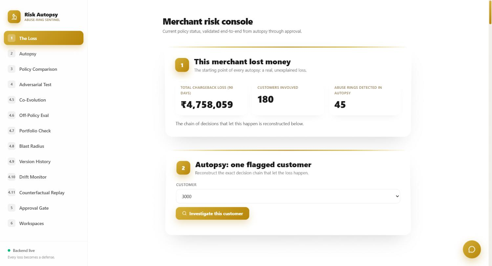 **Merchant risk console** — the loss, then live autopsy | 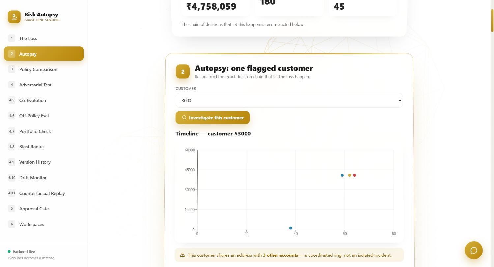 **Autopsy** — one customer's decision chain reconstructed |
| 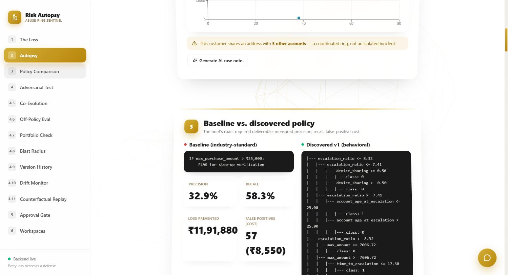 **Baseline vs. discovered policy** — the brief's exact required deliverable |  **Adversarial test** — 40/40 evasions caught after hardening |
|  **Automated co-evolution** — converged at generation 2 |  **Blast radius** — 5 of 82 flips worth attention |
| 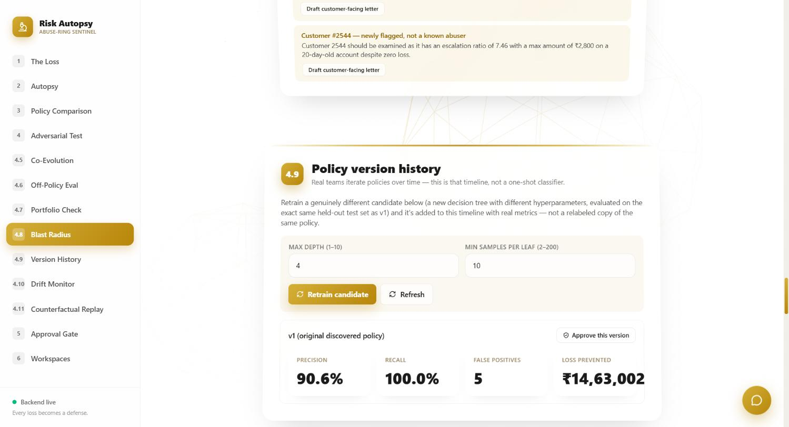 **Version history & approval** — real retraining, identity-verified sign-off |  **Live drift monitor** — the system critiquing its own coverage |
| 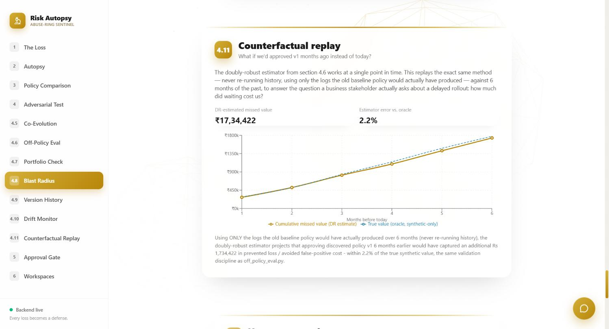 **Counterfactual replay** — what waiting cost | 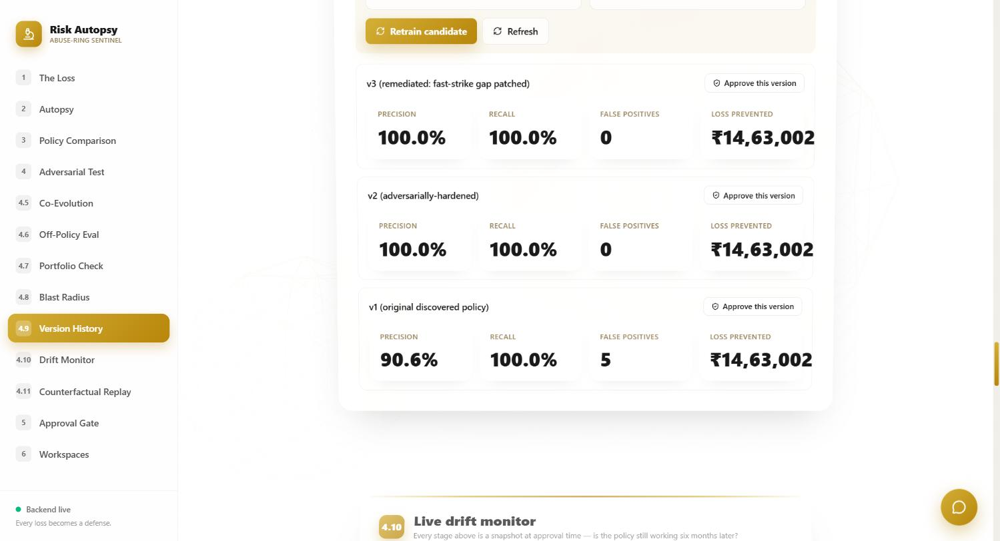 **Full timeline** — original, hardened, and remediated, each independently approvable |
|  **Closed the loop** — the drift-found gap, patched and re-verified, not just narrated |  **Autonomous Risk Policy Engineer** — AI autopsy + real feature discovery, grounded in real data |
|  **Candidates ranked by readiness** — 2 correctly BLOCKED, the winner registered unapproved | |

All screenshots are real captures of the running dashboard — none fabricated.

---

## Architecture

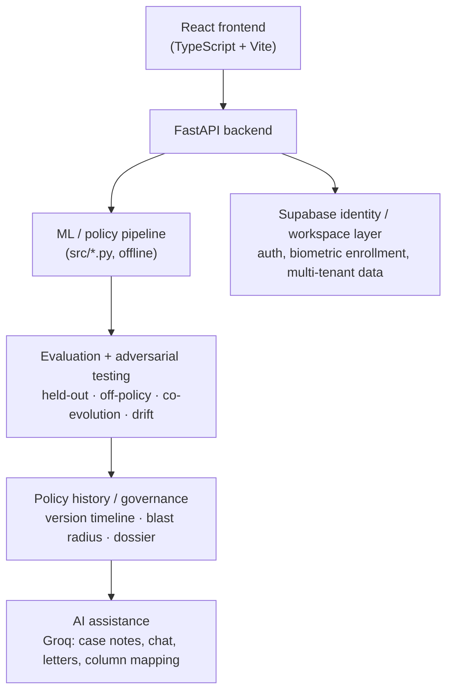

The ML pipeline runs offline and writes its results to `data/`; the backend serves those results live over HTTP (autopsy reconstruction is computed fresh per request, policy metrics are read from the artifacts the pipeline already produced — the standard train-offline/serve-online pattern). The frontend is a real React app. `_legacy_superseded/` holds two earlier working iterations kept for history — not what to run or demo. Full file-level structure is at the bottom of this document.

---

## Security & trust boundaries

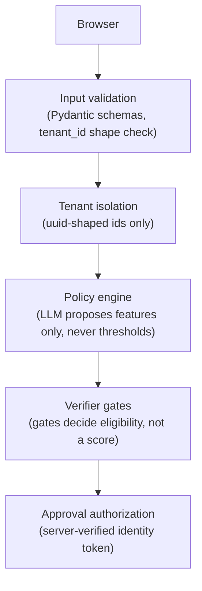

A focused audit, not a paid third-party one — but real testing against a running instance, not just code review. Full detail and every test name is in [`docs/ENGINEERING_LOG.md`](docs/ENGINEERING_LOG.md#security-audit--what-was-tested-what-was-found); the properties that matter:

| Boundary | How it's actually enforced |
|---|---|
| Client identity cannot authorize approval | A short-lived signed token, minted only after the backend independently re-verifies the Supabase session and re-computes the face match itself — never the browser's claim |
| Tenant IDs are validated before touching the filesystem | `tenant_id` must match the exact 12-char-hex shape it's generated in — **found and fixed a real, confirmed-exploitable path-traversal bypass of this** (see the engineering log) |
| The LLM cannot choose a threshold | Every threshold in every policy version (v1 through the autonomous engineer) was fit by `scikit-learn` on real data — never an LLM-specified number |
| The LLM cannot compute a metric | Precision, recall, adversarial coverage, fairness, off-policy value, blast radius, and complexity are all `pandas`/`scikit-learn` output — an LLM's role stops at proposing which features to try |
| The verifier gates eligibility, not a score | A candidate needs every gate to pass, full stop — a high weighted score cannot substitute for a failed gate |
| No auto-approval | Structurally impossible to reach — `register_external_policy` never sets `approved_by`; only `POST /api/policy/approve` does, and it requires the token above |
| Secrets are never committed | `.env` is gitignored; `.env.example` ships with empty values; verified by inspection of this repo's own history |
| A failed candidate cannot register as deployable | `run_autonomous_engineer` only calls the registration step when `readiness.status == APPROVAL_ELIGIBLE` |

---

## API reference

Every endpoint below is real and already running — this is documentation, not a promise.

```
POST /api/agent/run                       run the full autonomous loop (rate-limited, 5/hour)
GET  /api/agent/last                       the most recent run, without re-running it

GET  /api/policy/history                   every version, annotated with deployment_status
GET  /api/policy/active                    the one policy actually in force, or null
POST /api/policy/retrain                   train a new candidate with given hyperparameters
POST /api/policy/approval-token            mint a short-lived token after server-verified identity + face match
POST /api/policy/approve                   approve a version (requires the token above)

GET  /api/policy/comparison                baseline vs. v1 (the brief's required deliverable)
GET  /api/policy/adversarial               v1 vs. v2, the targeted evasion test
GET  /api/policy/coevolution                the original arms race result
GET  /api/policy/drift                     the fast-strike drift finding
GET  /api/policy/drift-remediation         v3's before/after re-verification
GET  /api/policy/attack-coverage           the per-dimension coverage map
GET  /api/policy/off-policy-eval           the doubly-robust estimate
GET  /api/policy/portfolio-conflict        the fairness segment check
GET  /api/policy/blast-radius              the per-customer diff
GET  /api/policy/counterfactual            what a delayed approval would have cost

GET  /api/autopsy/{customer_id}            live decision-chain reconstruction
GET  /api/dossier                          the compliance PDF, assembled from every stage above
```

---

## AI usage — honestly scoped

Groq (`openai/gpt-oss-120b`) is used for exactly four things, each grounded in real computed pipeline output, never asked to invent numbers: writing a case-note narrative from real autopsy data, answering reviewer questions grounded in the live dashboard's actual data, drafting the internal and customer-facing blast-radius notes, and mapping an arbitrary uploaded CSV's columns onto the pipeline's schema. None of these are the project's core innovation — the policy-engineering pipeline is. Without a Groq key, all four degrade gracefully with a clear inline message; everything else on the dashboard works regardless.

## Production & governance layer

These exist to show the core policy-engineering system can become a usable risk-operations product — not as the main pitch:

- **Identity-verified human-in-the-loop approval** for high-impact policy changes. The backend independently re-verifies the Supabase session and re-computes the face match server-side rather than trusting the frontend's claim that it matched — biometrics are the mechanism, not the innovation; the innovation is that the *server*, not the browser, is what actually authorizes an approval.
- **Compliance PDF dossier** — every stage's real computed output (held-out metrics, adversarial log, co-evolution result, off-policy evaluation, portfolio conflict, blast radius, approval record) assembled into one exportable artifact.
- **Policy version history** — real retraining on the same held-out split as v1, not a relabeled copy, with a full approval timeline.
- **Multi-tenant merchant workspaces** — upload any transactions CSV; an LLM maps its columns onto the pipeline's schema, and the analysis persists as a revisitable workspace.
- **Grounded chat and AI case notes** for reviewer-facing explanation.

---

## Engineering lessons

The strongest evidence of engineering rigor here is the history of real bugs found and fixed, not any single polished number. Six worth knowing:

1. **Temporal leakage** — an early feature set included `return_rate`/`return_lag`, which directly encoded whether the loss had already happened (0.88+ correlation with the label). Removed; features are now restricted to information available before any return/chargeback.
2. **The approval API accepted any client-supplied identity with zero server-side check** — a direct `curl` call could approve any policy version as anyone. Fixed with a short-lived signed token minted only after independently re-verifying the Supabase session and re-computing the face match server-side.
3. **A confirmed, exploitable path-traversal vulnerability in the multi-tenant workspace endpoints** — `GET /api/tenants/{tenant_id}` built a filesystem path directly from client input; a backslash-based traversal payload (`..%5Cpolicy_history`) successfully returned another file's full contents through the endpoint, verified with a live request. Fixed by validating `tenant_id` against the exact shape it's actually generated in (12-char hex) before it ever reaches a path.
4. **The adversarial arms race's own search coverage had a blind spot** — "zero evasions found, fully converged" never tested a fast-strike ring, because the attacker's search bounds started at 10 days. Found by the project's own drift monitor, then **actually fixed**: the arms race was re-run with the gap closed, re-verified against the same drift simulation, and registered as a new approvable version (v3) — not left as a recommendation.
5. **The autonomous engineer's fairness gate was statistically naive** — a segment ratio of 57× looked catastrophic but was one false positive in 52 people, an artifact of a near-zero population baseline. Fixed by requiring both a large ratio and a real absolute rate before calling something severe.
6. **The autonomous engineer's readiness gate only floored recall** — a 54.5%-precision candidate (40 false positives) was marked eligible until a precision floor matching v1's own bar was added.

The complete history — 19 entries, a security-audit summary, and full technical deep-dives on the off-policy estimator, the portfolio conflict finding, and the compliance dossier — is in [`docs/ENGINEERING_LOG.md`](docs/ENGINEERING_LOG.md).

---

## Data honesty

All data is **synthetic**, generated in `src/generate_data.py`, modeled on a documented real-world abuse typology (low-value purchase → wait → escalate to high-value → return/chargeback, executed across device/address-sharing rings). This is **not** claimed as "AI discovered a brand-new fraud pattern," and it is **not** a claim of production deployment or real-world fraud-detection accuracy. It's an automated policy-optimization pipeline, demonstrated end-to-end on realistic synthetic data — two of its evaluation methods (off-policy evaluation, portfolio conflict check) are specifically built to be honest about what they don't know, and the drift monitor is built to be honest about what the adversarial testing didn't cover. Every result above is a demonstrated result on this synthetic population, not a production claim.

---

## How to run

**Live demo:** _add your deployed URL here_ — see [Deploying](#deploying) below for a one-click Render Blueprint that ships this as a single free service.

**Works immediately after clone** — `data/` already has committed pipeline outputs, so the dashboard works without regenerating anything:

```bash
pip install fastapi uvicorn pandas numpy scikit-learn joblib groq python-dotenv python-multipart reportlab
uvicorn backend.main:app --port 8010          # terminal 1
cd webapp && npm install && npm run dev        # terminal 2
```

Open `http://localhost:5173`. The dashboard is public — no login required to browse it.

**Optional: regenerate the ML pipeline** (only needed if you want fresh numbers, not to run the app):

```bash
python src/generate_data.py
python src/features_and_policy.py
python src/adversarial_test.py
python src/coevolution.py
python src/off_policy_eval.py
python src/portfolio_conflict_check.py
python src/blast_radius.py
python src/drift_monitor.py
python src/counterfactual_replay.py
python src/remediate_drift.py         # closes the loop drift_monitor.py opened - real fix, re-verified
python src/attack_coverage.py         # per-dimension adversarial coverage, pre/post remediation
python src/evasion_distance.py        # imports attack_coverage.py's fixed point - run after it
python src/intervention_optimizer.py
python src/residual_cluster_analysis.py   # EXPERIMENTAL - see disclaimer in its own docstring/output
python src/difficulty_tiers_eval.py   # frozen policy vs. harder-by-construction data - run after intervention_optimizer.py
python src/secret_holdout_eval.py     # one-shot, seed never used elsewhere
python src/multi_seed_eval.py         # ~1-2 min - 10 independent seeds
python src/ablation_study.py          # requires intervention_optimizer.py's output
python src/mutation_testing.py
```

**The Autonomous Risk Policy Engineer runs through the API, not a script** (it needs the backend running, since it registers directly into `data/policy_history.json`):

```bash
curl -X POST http://localhost:8010/api/agent/run
```

Or click "Run autonomous engineer" in section 4.12 of the dashboard. Rate-limited to 5 runs/hour (each run does real ML work plus 2 LLM calls). A real run's output — including the winning candidate, registered as v5 — is already committed in this repo; running it again will produce a **different** set of LLM-proposed hypotheses (temperature 0.4, not deterministic) evaluated against the same real verifier.

**Optional: AI features** (case notes, chat, letters, CSV column mapping) — without this, those features degrade gracefully with a clear inline message; everything else works regardless:

```bash
cp backend/.env.example backend/.env
# put a free key from console.groq.com into backend/.env as GROQ_API_KEY=...
```

**Required only for the human-approval flow** (`backend/auth.py`'s server-side identity + face-match check):

```bash
# get the service_role key from your Supabase project -> Settings -> API
# put it in backend/.env as SUPABASE_SERVICE_ROLE_KEY=... (never commit this)
```

Without it, `POST /api/policy/approval-token` fails closed with a clear 503 rather than silently skipping the check — the rest of the dashboard is unaffected. Signing in (real Supabase auth + real face-api.js enrollment) is only needed to click "Submit for human approval," since that's the one action identity verification actually matters for.

**Supabase setup** (one-time, in your own Supabase project — credentials are already wired into `webapp/src/lib/supabase.ts` for this project's instance, but if you fork this you'll need your own):
1. Create a project at [supabase.com](https://supabase.com).
2. Run the schema SQL (see `_legacy_superseded/vanilla_js_login/supabase_schema.sql`) in the SQL editor.
3. Authentication → Providers → Email → turn off "Confirm email" for instant demo signup.

---

## Deploying

Ships as **one container, one free service** — `Dockerfile` builds the React frontend, then `backend/main.py` serves that build directly (static files mounted at `/assets`, a catch-all route serves `index.html` for client-side routes, every `/api/*` route still takes priority). No separate frontend host, no CORS to configure in production — the browser only ever talks to the same origin it loaded from.

**Render (recommended, free tier):**
1. Push this repo to your own GitHub.
2. In Render, **New +** → **Blueprint**, point it at the repo — `render.yaml` is already here and Render will read it automatically.
3. Once the service exists, add `GROQ_API_KEY` and/or `SUPABASE_SERVICE_ROLE_KEY` under its **Environment** tab if you want the AI features and the human-approval flow live (both are optional — the app degrades gracefully without them, see [AI usage](#ai-usage--honestly-scoped) above).
4. First deploy takes a few minutes (it's building the frontend from scratch); after that, `/api/health` is the health-check endpoint Render polls.

**Any other Docker host** (Railway, Fly.io, a VM) works the same way — build the `Dockerfile` at the repo root, run the resulting image, publish whatever port it listens on (`$PORT`, defaults to 8000).

**Verified locally before recommending this:** built the frontend, pointed the backend at that exact build, and hit it over HTTP — `/` and every client-side route (e.g. `/dashboard`) return the app shell, every `/api/*` route still resolves correctly and takes priority over the catch-all, an unmatched `/api/*` path correctly 404s instead of silently serving HTML, and a real browser session against it showed zero console errors and every API call succeeding same-origin. This isn't a theoretical setup — it's the exact code path a live deploy runs.

---

## Project structure

```
Razor/
├── README.md
├── docs/
│   ├── ENGINEERING_LOG.md      # full 19-bug history + technical deep-dives
│   └── screenshots/            # real dashboard captures used above
├── src/                        # the real ML pipeline
│   ├── dataset_tiers.py        # tier-parameterized population generator: easy/ambiguous/adversarial
│   ├── generate_data.py        # thin wrapper - writes the committed "easy" tier via dataset_tiers.py
│   ├── feature_engineering.py  # shared leakage-free build_features()/ring_grouped_split() - single source of truth
│   ├── features_and_policy.py  # baseline vs. discovered policy on the "easy" tier
│   ├── adversarial_test.py     # introspects v1, crafts a targeted evasion, retrains v2
│   ├── coevolution.py          # automated attacker/defender arms race until convergence
│   ├── off_policy_eval.py      # real doubly-robust off-policy evaluation, validated against oracle
│   ├── portfolio_conflict_check.py  # fairness/segment false-positive check
│   ├── blast_radius.py         # per-customer policy diff, ranked by ₹ impact
│   ├── drift_monitor.py        # live monitor: is the deployed policy still working, months later?
│   ├── counterfactual_replay.py # "what if we'd approved v1 N months ago?" — the DR estimator replayed over historical time
│   ├── remediate_drift.py      # closes the loop: re-runs the arms race with the drift-found gap widened, re-verifies, registers v3
│   ├── attack_coverage.py      # per-dimension adversarial coverage map, pre/post remediation
│   ├── evasion_distance.py     # smallest behavioral perturbation that flips the decision - a robustness metric, imports attack_coverage.py's fixed point
│   ├── intervention_optimizer.py  # graded ALLOW/STEP_UP/DELAY/MANUAL_REVIEW/BLOCK ladder, real expected-₹-value per action
│   ├── residual_cluster_analysis.py  # EXPERIMENTAL unsupervised residual scan - explicitly not a fraud-discovery claim, see its own disclaimer
│   ├── difficulty_tiers_eval.py    # frozen policy scored (never retrained) against harder-by-construction data
│   ├── secret_holdout_eval.py      # one-shot score against a seed never used elsewhere in this repo
│   ├── multi_seed_eval.py          # 10 independent seeds, mean/std - is the headline number seed-fragile?
│   ├── ablation_study.py           # which pipeline stage earns its place, using already-real artifacts
│   └── mutation_testing.py         # deliberately breaks the policy's tree structure - does the verification suite catch it?
├── data/                       # committed pipeline outputs (json/csv/joblib) — app works immediately after clone
│   └── tenants/                # gitignored — uploaded merchant workspaces (backend/dataset.py), runtime only
├── backend/
│   ├── main.py                 # FastAPI — serves the pipeline results live + AI endpoints
│   ├── agent.py                # the Autonomous Risk Policy Engineer: autopsy, feature discovery, hypothesis synthesis, attack/harden, verifier (8 gates), readiness score
│   ├── causal_graph.py         # per-customer decision-path attribution - the exact split sequence a tree took, live-computed, scoped explicitly to "this model's decision"
│   ├── auth.py                 # server-side approval verification: real Supabase identity + face-match re-check, signed short-lived tokens
│   ├── llm.py                  # Groq integration: case notes, grounded chat, letters, CSV column mapping
│   ├── dataset.py              # unsupervised ring-signal analysis + multi-tenant workspace persistence
│   ├── policy_history.py       # real policy retraining + version timeline, every version carries the same 8-gate "Policy PR" checklist
│   ├── dossier.py              # compliance PDF export (ReportLab)
│   └── .env.example            # copy to .env and add GROQ_API_KEY / SUPABASE_SERVICE_ROLE_KEY (gitignored, never committed)
├── webapp/                     # the real frontend: React + TypeScript + Vite
│   ├── src/pages/Login.tsx     # Supabase auth + face-api.js biometric verification (scoped to approval, not a site-wide gate)
│   ├── src/pages/Dashboard.tsx # all sections, live data from the backend
│   ├── src/components/         # Background3D (react-three-fiber), GlassCard (Framer Motion scroll tilt),
│   │                            # ApprovalModal (login + face match), ChatWidget, DatasetUpload, etc.
│   └── public/models/          # face-api.js model weights, bundled locally (not CDN-dependent)
├── tests/test_pipeline.py      # regression tests for every claim above
└── _legacy_superseded/         # earlier working iterations, kept for history — not the demo to run
```
