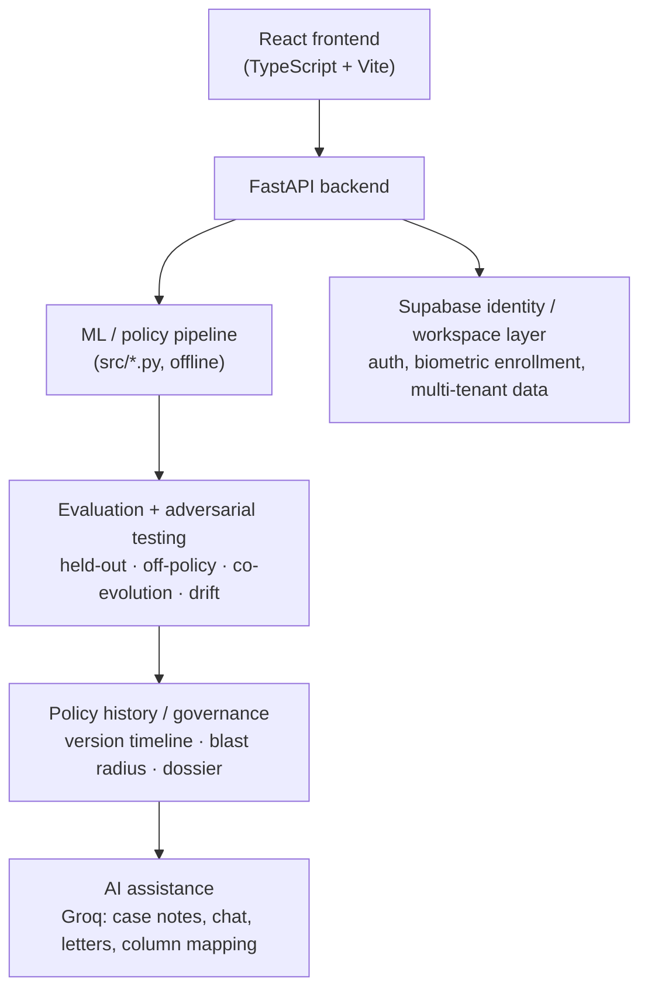
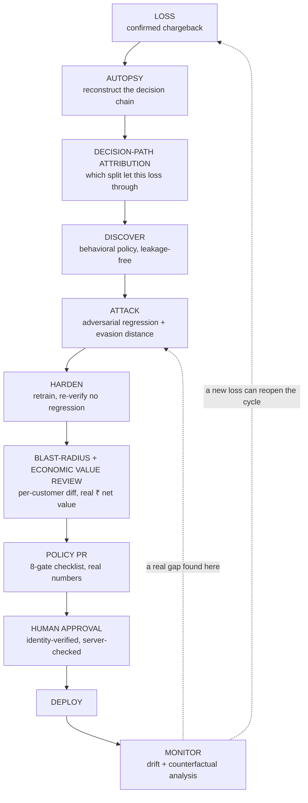
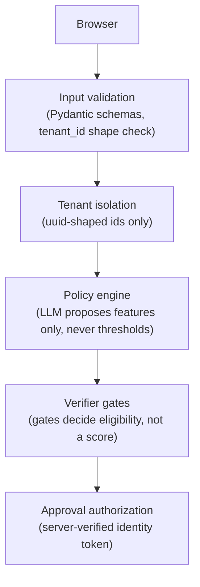

# Risk Autopsy — Architecture

This is the engineering reference: what runs where, how data flows, and where the trust boundaries are. For the product pitch and evidence, see the [README](../README.md); for the full bug-by-bug build history, see [ENGINEERING_LOG.md](ENGINEERING_LOG.md).

## System overview



**Deliberate choice, stated plainly:** the ML pipeline is offline (`src/*.py` writes results to `data/`; the backend reads those artifacts and serves them over HTTP) rather than a live streaming/feature-store architecture, and the policy model is a shallow, depth-limited decision tree rather than an ensemble. Both are scope decisions for a hackathon prototype whose core claim is that a human can read and verify the actual rule before approving it — not gaps we didn't get to. See [README § Architecture](../README.md#architecture) for the one-line version of this same statement in context.

## The policy lifecycle



Every stage above is a real, independently-runnable script in `src/`, wired together two ways: manually (a human runs one stage at a time via the dashboard's buttons) or autonomously (`backend/agent.py` runs the whole loop end to end, still stopping at the same human-approval gate — see README § The Autonomous Risk Policy Engineer). Nothing in this diagram can skip the approval boundary; see [Trust boundaries](#trust-boundaries) below for how that's enforced, not just diagrammed.

## Components

| Layer | What it is | Where |
|---|---|---|
| ML pipeline | Feature engineering, policy discovery, adversarial hardening, off-policy eval, drift simulation, evaluation-rigor suite — 20 independent scripts, each runnable standalone | `src/*.py` |
| Autonomous engineer | AI autopsy → feature discovery → LLM hypothesis synthesis → attack/harden → 8-gate verify → register-if-eligible, in one call | `backend/agent.py` |
| Decision-path attribution | Per-customer traversal of the exact `DecisionTreeClassifier` split sequence — a true statement about the model's decision, not a causality claim | `backend/causal_graph.py` |
| Governance | Policy version timeline, deployment-status annotation, gate-record persistence | `backend/policy_history.py` |
| Approval auth | Server-side identity re-verification + face-match re-computation, short-lived signed tokens | `backend/auth.py` |
| AI assistance | Groq LLM calls for case notes, grounded chat, customer letters, CSV column mapping — never metrics, never thresholds | `backend/llm.py` |
| Multi-tenant workspaces | Unsupervised ring-signal scan for uploaded CSVs (no ground truth available) + tenant persistence | `backend/dataset.py` |
| Compliance export | Assembles every stage's real output into one PDF | `backend/dossier.py` |
| API surface | FastAPI routes serving the above live | `backend/main.py` |
| Frontend | React + TypeScript + Vite dashboard; one page (`Dashboard.tsx`), 15 sections, a primary-spine sidebar with a collapsed deep-validation group | `webapp/src/` |

## Data flow

The pipeline follows a standard **train-offline / serve-online** split:

1. `src/*.py` scripts run independently (locally or via CI), each writing its result as JSON/CSV/joblib into `data/` — committed to the repo so the app works immediately after clone, with no regeneration step required.
2. `backend/main.py` reads those artifacts and serves them over HTTP. Two categories of endpoint exist: ones that read a precomputed artifact directly (e.g. `GET /api/policy/comparison`), and ones that compute fresh per request against already-loaded models (e.g. `GET /api/autopsy/{customer_id}`, which reconstructs a decision chain live).
3. The frontend never talks to the ML pipeline directly — every number on the dashboard came from a real script's real output, through this one HTTP boundary.

## Trust boundaries



The properties that actually hold this together (full detail and every test name in [ENGINEERING_LOG.md § security audit](ENGINEERING_LOG.md#security-audit--what-was-tested-what-was-found)):

- **Client identity cannot authorize approval.** A short-lived signed token is minted only after the backend independently re-verifies the Supabase session and re-computes the face match itself.
- **Tenant IDs are shape-validated before touching the filesystem.** A confirmed, exploitable path-traversal bypass was found and fixed here during development — not a theoretical concern.
- **The LLM cannot choose a threshold or compute a metric.** Every threshold is `scikit-learn` output fit on real data; every metric is `pandas`/`scikit-learn` output. The LLM's role stops at proposing which features to try.
- **The verifier gates eligibility, not a score.** All eight gates must pass; a high weighted score never substitutes for a failed gate.
- **No auto-approval path exists.** `register_external_policy` never sets `approved_by` — only `POST /api/policy/approve` does, and it requires the server-issued token above.

## API surface

```
POST /api/agent/run                       run the full autonomous loop (rate-limited, 5/hour)
GET  /api/agent/last                       the most recent run, without re-running it

GET  /api/policy/history                   every version, annotated with deployment_status
GET  /api/policy/active                    the one policy actually in force, or null
POST /api/policy/retrain                   train a new candidate with given hyperparameters
POST /api/policy/approval-token            mint a short-lived token after server-verified identity + face match
POST /api/policy/approve                   approve a version (requires the token above)

GET  /api/policy/comparison                baseline vs. v1 (the brief's required deliverable)
GET  /api/policy/adversarial               v1 vs. v2, the targeted evasion test
GET  /api/policy/coevolution                the original arms race result
GET  /api/policy/drift                     the fast-strike drift finding
GET  /api/policy/drift-remediation         v3's before/after re-verification
GET  /api/policy/attack-coverage           the per-dimension coverage map
GET  /api/policy/off-policy-eval           the doubly-robust estimate
GET  /api/policy/portfolio-conflict        the fairness segment check
GET  /api/policy/blast-radius              the per-customer diff
GET  /api/policy/counterfactual            what a delayed approval would have cost

GET  /api/autopsy/{customer_id}            live decision-chain reconstruction
GET  /api/dossier                          the compliance PDF, assembled from every stage above
```

## Tech stack

| | |
|---|---|
| Frontend | React 19, TypeScript, Vite, Tailwind v4, Recharts, @xyflow/react (decision-tree diagram), Framer Motion |
| Backend | FastAPI, Pydantic |
| ML | scikit-learn (`DecisionTreeClassifier`, `RandomForestClassifier`), pandas, numpy |
| AI assistance | Groq (`openai/gpt-oss-120b`) — four narrowly-scoped uses only, see [README § AI usage](../README.md#ai-usage--honestly-scoped) |
| Identity | Supabase (auth + biometric enrollment via face-api.js), server-side re-verification |
| Tests | pytest — 121 passing regression tests covering the claims above, `tests/test_pipeline.py` |
| Deployment | Single Docker container; FastAPI serves the built React static files directly, no separate frontend host |

## Where to look next

- Product pitch, honest metrics, and the fast-strike drift finding: [README.md](../README.md)
- Every bug found and fixed during development, with root causes: [ENGINEERING_LOG.md](ENGINEERING_LOG.md)
- The 5-minute pitch structure: [PITCH_SCRIPT.md](PITCH_SCRIPT.md)
